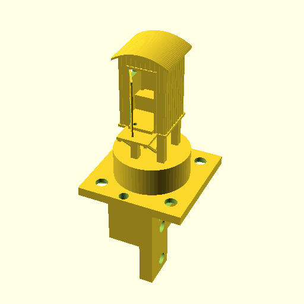

# Miniature lavatory

Miniature lavatory with servo controlled door. The servo and light are controlled by a micro controller. When a person presses a button the lights turn-on and the door will open.

Now this miniature 3D printed model is on display on a miniture model of this train station anno 1950, on the [Modelspoorclub Alkmaar](http://www.modelspoorclubalkmaar.nl/) (Model rail club Alkmaaar).

